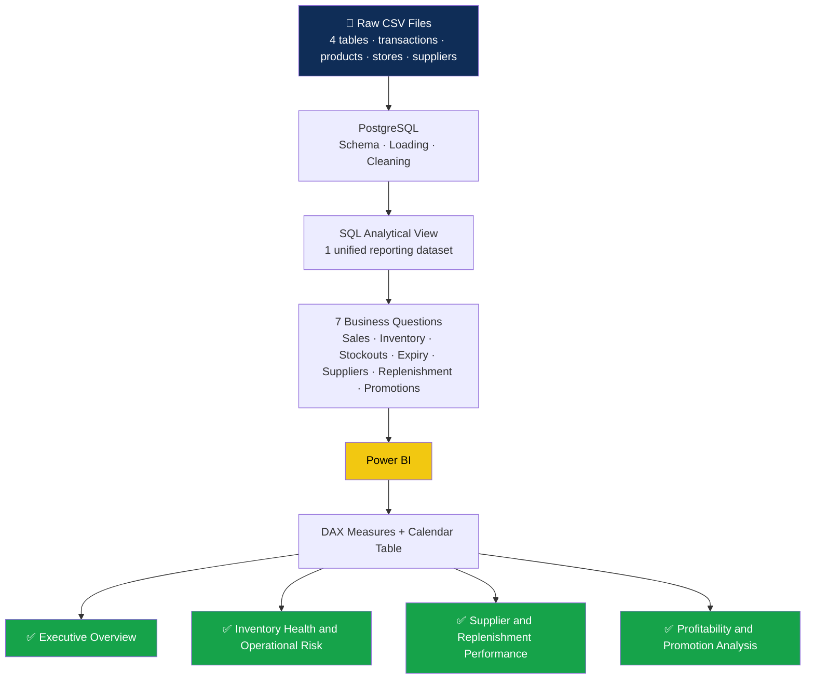

# Retail Inventory and Supply Chain Analytics

<p align="center">
  
  
  
  
  
</p>

<br>

> **Can a retail grocery business see its problems before customers do?**
>
> ShelfCo runs five branches across Ibadan, Nigeria. Stockouts are happening even during low demand periods. Perishable products are expiring while sitting in the same stores that keep reordering them. And promotions are running without any measurable return.
>
> This project works through those problems across seven business areas, starting from raw CSV files, moving through PostgreSQL analysis, and ending with a four page Power BI dashboard that turns inventory data into decisions any operations team can act on immediately.

<br>

## Executive Summary

ShelfCo's inventory data tells a consistent story across seven areas of analysis. A small group of fast moving products drives most of the revenue, yet the entire inventory is operating at low or critical stock levels. The 38.2 percent stockout rate is not a demand problem. Stockouts are happening during low demand periods, which points directly to planning and replenishment failures. Perishable categories are simultaneously the most over ordered and the most at risk of expiry. Supplier damage rates are highest for frozen and fragile goods. Promotions are generating minimal additional revenue across most categories. Every one of these findings has a clear, data backed recommendation attached to it.

<br>

## Key Numbers at a Glance

| Metric | Value |
|:--|:--|
| Number of stores | 5 branches across Ibadan |
| Overall stockout rate | 38.2% |
| Products at critical stock levels | 458 out of all stock records reviewed |
| Products at low stock levels | 384 |
| Products at healthy stock levels | 37 |
| Shortest stock coverage | Bread and Coca Cola at 1.6 to 4 days remaining |
| Already expired products | 154 |
| Expiring within 30 days | 301 |
| Highest restock to sales ratio | Butter at 5.5x |
| Supplier with longest lead time | CoolFresh Logistics at 6 days average |
| Top revenue category | Beverages at 14.4 million naira |
| Top revenue store | ShelfCo Mokola at 11.25 million naira |

<br>

## Project Workflow



<br>

## The Data

The dataset was built specifically for this project to simulate realistic retail inventory conditions across a multi store grocery business. It is not real company data. The simulation was designed to reflect the kinds of challenges that actually appear in retail operations: demand and supply mismatches, perishable product mismanagement, over ordering, and supplier inconsistency.

| Table | Description |
|:--|:--|
| `products` | Product names, categories, and pricing information |
| `stores` | The five store locations and their details |
| `suppliers` | Supplier names, lead times, and operational data |
| `inventory_supply_chain_analysis` | The main table covering inventory levels, sales, replenishment quantities, expiry dates, damage records, and stockout flags |

Rather than loading all four tables separately into Power BI, a SQL analytical view was created in PostgreSQL to join and prepare everything into one clean reporting dataset.

<br>

## SQL Business Analysis

The SQL analysis covers seven business areas. Each section was approached as a standalone business problem with specific questions to answer.

📄 **[Read the full SQL analysis with all queries, outputs, and findings](https://github.com/jimi121/jimi121-Supply-Chain-Analytics-Projects/blob/main/Retail%20Inventory%20%26%20Supply%20Chain%20Analytics/analysis/ShelfCo_SQL_Analysis.md)**

<br>

### 1. Sales and Profitability

**What I was trying to find out**

Which products and categories are generating the most revenue and profit, and how the five stores compare in financial performance.

**What the data showed**

Bread leads revenue across all stores, followed by Coca Cola, Meat Pie, and Maltina Can. Beverages and Bakery are the top two categories by both revenue and profit. Store performance is broadly balanced, with ShelfCo Akobo and ShelfCo Mokola edging slightly ahead.

**What this means for the business**

A small group of products is carrying a large share of business performance. Losing any of them to a stockout has an immediate revenue impact.

**Recommendations**

Products like Bread, Coca Cola, and Meat Pie need closer monitoring and faster replenishment cycles. High performing categories deserve more inventory investment. Stronger stores can serve as operational benchmarks for locations that are slightly behind.

<br>

### 2. Inventory Health

**What I was trying to find out**

What the current stock condition looks like across all products and stores, and how much time is left before critical products run out.

**What the data showed**

458 stock records are at critical levels, 384 are low, and only 37 are healthy. Products like Bread and Coca Cola have between 1.6 and 4 days of coverage remaining.

**What this means for the business**

When almost everything is running low at the same time, the business has no room to absorb a supplier delay or an unexpected spike in demand.

**Recommendations**

Inventory monitoring needs to shift from reactive to proactive. Reorder levels should be reviewed regularly against actual sales velocity, and safety stock for high demand products should be increased to create a real buffer.

<br>

### 3. Stockout Risk

**What I was trying to find out**

Which products and stores are experiencing the most stockouts, and whether the cause is demand or planning.

**What the data showed**

Biscuits recorded a 100 percent stockout rate. Butter and Frozen Fish were close behind. ShelfCo Jericho and ShelfCo Akobo had the highest store level stockout rates at 40.8 percent and 40.4 percent. Stockouts were also occurring during periods of low customer demand.

**What this means for the business**

Stockouts during low demand periods cannot be explained by volume. The replenishment process itself is the problem. Products are not being reordered at the right time or in the right quantities.

**Recommendations**

Replenishment timing and order quantities need review, particularly for Bakery, Dairy, and Frozen Food products. Stores with persistently high stockout rates need closer operational attention.

<br>

### 4. Expiry and Inventory Waste

**What I was trying to find out**

How much inventory is expiring before it sells, which categories carry the most risk, and whether over ordering is making it worse.

**What the data showed**

154 products have already expired and 301 more are expiring within 30 days. Dairy and Frozen Foods carry the highest exposure. The same products appearing most often in the expiry risk list are also among the most over ordered in the dataset.

**What this means for the business**

Over ordering perishables and then watching them expire is one of the most avoidable losses in retail. Replenishment quantities are not being tied closely enough to actual sales rates.

**Recommendations**

Order quantities for perishable products should be matched to real sales movement on a rolling basis. Stock rotation needs to be tightened so older inventory sells first. Near expiry products should be supported with targeted discounts before they become a complete write off.

<br>

### 5. Supplier Performance

**What I was trying to find out**

How suppliers compare on delivery speed and product quality, and which combinations are causing the most operational problems.

**What the data showed**

CoolFresh Logistics has the longest average lead time at 6 days. FreshBake Suppliers and CoolFresh Logistics both recorded the highest rates of damaged goods on arrival. Meat Pie, Frozen Fish, and Ice Cream are the products most frequently affected by transit damage.

**What this means for the business**

The bigger concern is not lead time length but damage rates, especially for frozen and perishable products. Damaged deliveries create stock gaps that quickly turn into stockouts.

**Recommendations**

Damaged inventory should be tracked consistently and fed back to suppliers in regular performance reviews. Packaging and handling standards for fragile products should be discussed directly with the relevant suppliers.

<br>

### 6. Replenishment Efficiency

**What I was trying to find out**

Whether products are being restocked in quantities that match actual demand, or whether over ordering is creating unnecessary cost and waste.

**What the data showed**

Several products have restock to sales ratios well above 2. Butter sits at 5.5, Biscuits at 3.9, Cheese at 3.2, and Frozen Fish at 3.1. Dairy and Frozen Foods show the worst overall replenishment imbalance.

**What this means for the business**

Over ordering fills storage space, increases expiry risk, ties up cash in stock that is not moving, and makes it harder to identify products that genuinely need attention.

**Recommendations**

Order quantities should be reviewed against recent sales performance on a rolling basis. Products with consistently high restock to sales ratios should have their volumes reduced and monitored closely. Demand forecasting should become a standard input to the replenishment process.

<br>

### 7. Promotion Effectiveness

**What I was trying to find out**

Whether promotions are generating meaningful additional sales or running without a measurable return.

**What the data showed**

The revenue difference between promotional and non promotional periods is small across most categories. Dairy and Frozen Foods responded slightly better than others, but the overall lift was not significant.

**What this means for the business**

Running promotions that do not move the needle is a cost without a clear benefit. Spreading promotional effort evenly across all categories is not the right approach when some categories respond and others do not.

**Recommendations**

Promotional strategies should be focused on categories that show a measurable response. Bundle deals, limited time discounts, or seasonal campaigns could be tested as alternatives. Any promotional activity should be coordinated with inventory planning to make sure the promoted products are actually available in stock.

<br>

## Power BI Dashboard

After completing the SQL analysis, a four page Power BI dashboard was built to present the findings in a way that is easy to understand and act on. Each page answers a specific business question rather than simply displaying charts.

The dashboard follows a logical flow from overall performance, to inventory risks, to supplier operations, to profitability.

🔗 **[View the full interactive Power BI dashboard](https://app.powerbi.com/view?r=eyJrIjoiM2M0ZmJhYjYtODE2Yi00YmU1LWJkZTktMWY1YmFmNTYwMmQ1IiwidCI6IjYyMGJjNTRiLTE2Y2YtNDhjNy1iNWE3LTY0ZmFkNmI5OTdhZiJ9)**

<br>

### Page 1 — Executive Overview

A high level picture of how the business is performing across all five stores. Covers total revenue, profit, profit margin, stockout rate, and the percentage of products currently at risk. ShelfCo Mokola leads on revenue at 11.25 million naira while ShelfCo Akobo leads on profit at 3 million naira. Beverages is the top revenue category at 14.4 million naira, followed by Bakery at 11.8 million naira.


<br>

### Page 2 — Inventory Health and Operational Risk

Goes deeper into stock condition across the business. Shows how many products sit at critical, low, or healthy stock levels by category, which stores have the highest stockout rates, and how expiry risk is distributed. The inventory action monitoring table at the bottom flags each product as OK, LOW STOCK, or REORDER so an operations team knows exactly where attention is needed without interpreting charts.


<br>

### Page 3 — Supplier and Replenishment Performance

Brings together supplier delivery performance and replenishment efficiency in one view. Shows how each supplier compares on lead time and damage rates, which products carry the highest restock to sales ratios, and how replenishment behaviour differs across categories. The summary table gives a direct side by side view of average restock quantity versus average quantity sold per category.


<br>

### Page 4 — Profitability and Promotion Analysis

Connects product and category performance to the bottom line. Shows profit margins by category, the top revenue generating products, monthly profit trends, and how promotional activity compares to non promotional periods. Profit margins are consistent across categories, ranging from 26.53 percent to 26.79 percent. A noticeable dip appears around June and July. Promotions show limited additional revenue impact across most categories.


<br>

## What I Learned Building This

The most important finding in this project did not come from the dashboard. It came from a SQL query on stockout timing.

When stockouts are happening during low demand periods, the instinct is to question the data. But the data was consistent. Products were running out not because customers were buying more than expected, but because replenishment decisions were not connected to what was actually selling. That single observation reframed the entire analysis from a demand problem into a planning problem, and that distinction changes every recommendation that follows.

Building the dashboard also took more thought than expected. Adding more charts was easy. Deciding which ones actually helped someone understand the business was harder. The four page structure, each page anchored to a specific business question, was the answer. That principle kept the dashboard focused even when the temptation to add something visually interesting but operationally meaningless was strong.

<br>

## Project Files

| File | Description |
|:--|:--|
| [`datasets/transactions.csv`](https://github.com/jimi121/jimi121-Supply-Chain-Analytics-Projects/blob/main/Retail%20Inventory%20%26%20Supply%20Chain%20Analytics/datasets/transactions.csv) | Raw transactional data covering sales, stock movements, and stockout records across all five ShelfCo branches |
| [`datasets/products.csv`](https://github.com/jimi121/jimi121-Supply-Chain-Analytics-Projects/blob/main/Retail%20Inventory%20%26%20Supply%20Chain%20Analytics/datasets/products.csv) | Product reference data including names, categories, reorder levels, and expiry information |
| [`datasets/stores.csv`](https://github.com/jimi121/jimi121-Supply-Chain-Analytics-Projects/blob/main/Retail%20Inventory%20%26%20Supply%20Chain%20Analytics/datasets/stores.csv) | Store details for all five ShelfCo branch locations in Ibadan |
| [`datasets/suppliers.csv`](https://github.com/jimi121/jimi121-Supply-Chain-Analytics-Projects/blob/main/Retail%20Inventory%20%26%20Supply%20Chain%20Analytics/datasets/suppliers.csv) | Supplier information including names, lead times, and product supplier mappings |
| [`sql/schema_creation.sql`](https://github.com/jimi121/jimi121-Supply-Chain-Analytics-Projects/blob/main/Retail%20Inventory%20%26%20Supply%20Chain%20Analytics/sql/schema_creation.sql) | CREATE TABLE statements and database schema for the ShelfCo inventory dataset in PostgreSQL |
| [`sql/data_loading.sql`](https://github.com/jimi121/jimi121-Supply-Chain-Analytics-Projects/blob/main/Retail%20Inventory%20%26%20Supply%20Chain%20Analytics/sql/data_loading.sql) | Scripts to import and load the raw dataset into the PostgreSQL database |
| [`sql/analytical_view.sql`](https://github.com/jimi121/jimi121-Supply-Chain-Analytics-Projects/blob/main/Retail%20Inventory%20%26%20Supply%20Chain%20Analytics/sql/analytical_view.sql) | SQL view that aggregates and prepares data for use as the Power BI data source |
| [`sql/business_queries.sql`](https://github.com/jimi121/jimi121-Supply-Chain-Analytics-Projects/blob/main/Retail%20Inventory%20%26%20Supply%20Chain%20Analytics/sql/business_queries.sql) | All seven business analysis query sets covering sales, inventory, stockouts, expiry, suppliers, restocking, and promotions |
| [`analysis/shelfco_sql_analysis.md`](https://github.com/jimi121/jimi121-Supply-Chain-Analytics-Projects/blob/main/Retail%20Inventory%20%26%20Supply%20Chain%20Analytics/analysis/ShelfCo_SQL_Analysis.md) | Full written analysis including SQL queries, outputs, insights, and recommendations for each business question |
| [`presentation/project_presentation_slides.pdf`](https://github.com/jimi121/jimi121-Supply-Chain-Analytics-Projects/blob/main/Retail%20Inventory%20%26%20Supply%20Chain%20Analytics/presentation/project%20presentation%20sildes.pdf) | Slide deck summarising the project objectives, key findings, and business recommendations |
| [`images/overview_dashboard.png`](https://github.com/jimi121/jimi121-Supply-Chain-Analytics-Projects/blob/main/Retail%20Inventory%20%26%20Supply%20Chain%20Analytics/images/overview%20dashboard.PNG) | Screenshot of the overview dashboard showing high level KPIs and revenue performance |
| [`images/inventory_dashboard.png`](https://github.com/jimi121/jimi121-Supply-Chain-Analytics-Projects/blob/main/Retail%20Inventory%20%26%20Supply%20Chain%20Analytics/images/inventory%20dashboard.PNG) | Screenshot of the inventory health dashboard showing stock status, coverage days, and critical stock alerts |
| [`images/supplier_dashboard.png`](https://github.com/jimi121/jimi121-Supply-Chain-Analytics-Projects/blob/main/Retail%20Inventory%20%26%20Supply%20Chain%20Analytics/images/suppliers%20dashboard.PNG) | Screenshot of the supplier performance dashboard showing lead times and damage rates by supplier |
| [`images/profitability_dashboard.png`](https://github.com/jimi121/jimi121-Supply-Chain-Analytics-Projects/blob/main/Retail%20Inventory%20%26%20Supply%20Chain%20Analytics/images/profitability%20dashboard.PNG) | Screenshot of the profitability dashboard showing revenue and profit breakdown by product, category, and store |

<br>

## Repository Structure

```
retail-inventory-supply-chain-analytics/
│
├── datasets/
│   ├── transactions.csv
│   ├── products.csv
│   ├── stores.csv
│   └── suppliers.csv
│
├── sql/
│   ├── schema_creation.sql
│   ├── data_loading.sql
│   ├── analytical_view.sql
│   └── business_queries.sql
│
├── analysis/
│   └── shelfco_sql_analysis.md
│
├── presentation/
│   └── project_presentation_slides.pptx
│
├── images/
│   ├── overview_dashboard.png
│   ├── inventory_dashboard.png
│   ├── supplier_dashboard.png
│   └── profitability_dashboard.png
│
└── README.md
```

<br>

## Tools Used

| Tool | Purpose |
|:--|:--|
| PostgreSQL | Database design, business analysis, and the analytical view |
| Power BI | Building the interactive four page dashboard |
| DAX | KPI measures, trend calculations, and the calendar table |
| Excel | Preparing and staging the raw dataset files before loading into PostgreSQL |
| PowerPoint | Project presentation deck summarising objectives, findings, and recommendations |

<br>

## About This Project

This is a personal portfolio project. The data is simulated and ShelfCo is a fictional grocery chain. The problems it represents are not fictional.

Empty shelves, expiring stock, suppliers sending damaged goods, and replenishment decisions made without looking at what actually sold. These things are happening in real retail businesses right now. This project shows what changes when you use the data to make those decisions.

<br>

<p align="center">
  <strong>Olajimi Adeleke</strong><br>
  Data Analyst<br><br>
  <a href="https://www.linkedin.com/in/olajimi-adeleke">LinkedIn</a>
  &nbsp;&nbsp;
  <a href="https://jimi121.github.io/">Portfolio</a>
</p>
